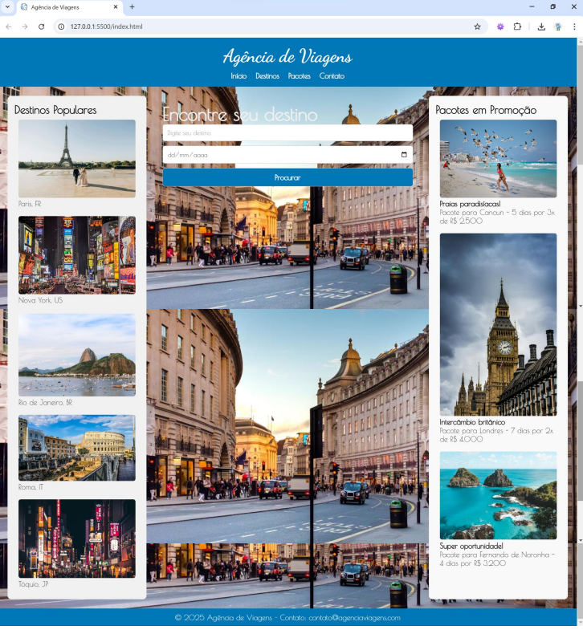

# AgenciaViagem
 
# ✈️ AgenciaViagem - Landing Page


<p align="center">
  
</p>

## 💻 Sobre o Projeto

O **AgenciaViagens** é uma Landing Page moderna e responsiva desenvolvida com foco em **SEO (Search Engine Optimization)** e boas práticas de Front-end. O projeto simula a página de uma Agência de viagens fictícia, apresentando produtos, receitas e novidades.

Este projeto foi desenvolvido como parte do currículo do curso **Técnico em Desenvolvimento de Sistemas** da Escola **SENAI A. Jacob Lafer**.

---

## ⚙️ Funcionalidades e Conceitos Aplicados

Durante o desenvolvimento, foram aplicados os seguintes conceitos técnicos:

-   **HTML Semântico:** Uso correto de tags (`<header>`, `<main>`, `<section>`, `<footer>`) para melhorar a acessibilidade e o ranqueamento nos motores de busca (SEO).
-   **CSS Moderno:** -   Layouts flexíveis com **Flexbox**.
    -   Posicionamento e estilização de elementos.
    -   Responsividade com **Media Queries** (Mobile First).
-   **Versionamento:** Controle de versão utilizando **Git** e **GitHub Desktop**.

---

## 🛠 Tecnologias Utilizadas

As seguintes ferramentas foram usadas na construção do projeto:

-    **HTML5**
-    **CSS3**
-    **Git**

---

## 📂 Estrutura de Pastas

```bash
BalleCoffee/
├── img/          # Imagens, ícones e recursos visuais
├── index.html       # Estrutura principal (Home)
├── style.css        # Folhas de estilo (Design e Layout)
└── README.md        # Documentação do projeto